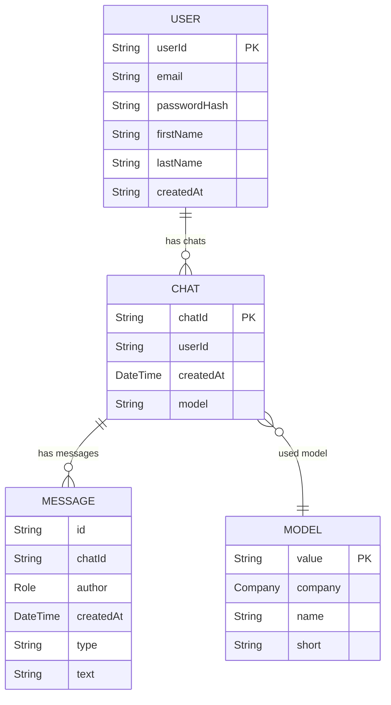

```mermaid
erDiagram
  USER {
    String userId PK
    String email
    String passwordHash
    String firstName
    String lastName
    String createdAt
  }
  CHAT {
    String chatId PK
    String userId
    DateTime createdAt
    String model
  }
  MESSAGE {
    String id
    String chatId
    Role author
    DateTime createdAt
    String type
    String text
  }
  MODEL {
    String value PK
    Company company
    String name
    String short
  }
  USER ||--o{ CHAT : "has chats"
  CHAT ||--o{ MESSAGE : "has messages"
  CHAT }o--|| MODEL : "used model"
```
